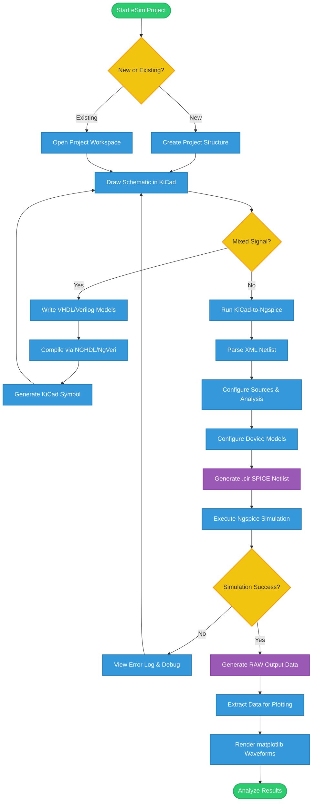
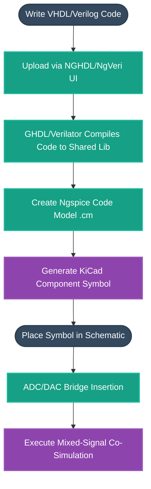
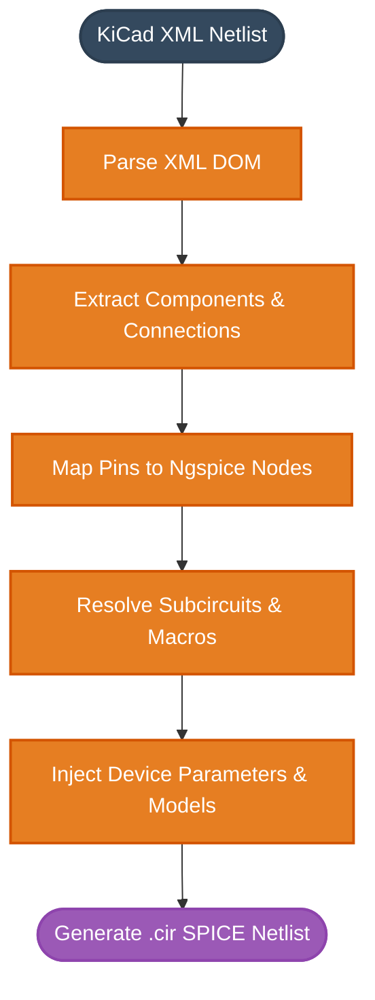

# eSim Architecture & Workflows

This document contains detailed flowcharts and diagrams mapping out the inner workings, simulation pipelines, and data transformations within eSim.

---

## 1. Standard Simulation Workflow

This flowchart details the end-to-end user journey for a standard analog/digital simulation in eSim, from project creation to waveform analysis.

---

## 2. Mixed-Signal Simulation Flow (NGHDL)

This diagram breaks down how eSim bridges digital logic (VHDL/Verilog) with analog simulation using GHDL and Ngspice code models.

---

## 3. KiCad-to-Ngspice Netlist Conversion

A deep dive into the `Convert.py` backend pipeline, showing how KiCad's XML data is processed into an executable SPICE netlist.

---

## 4. Device Model Generation Pipeline

Outlining how user-defined models (Diodes, BJTs, MOSFETs) are integrated via the Model Editor.

