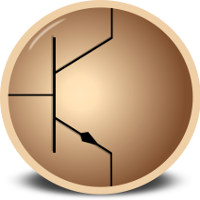
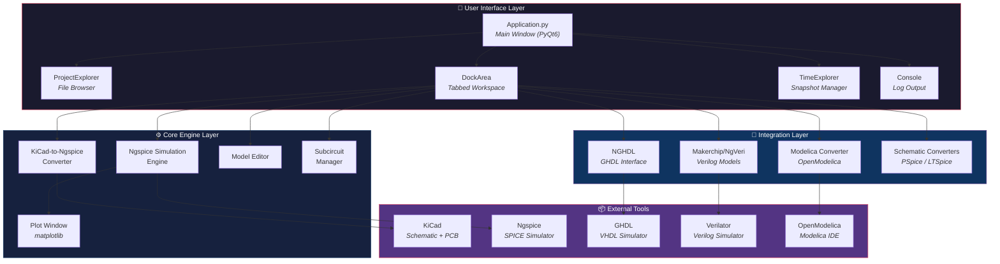
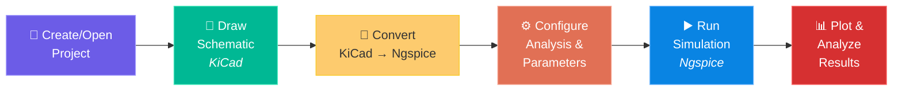
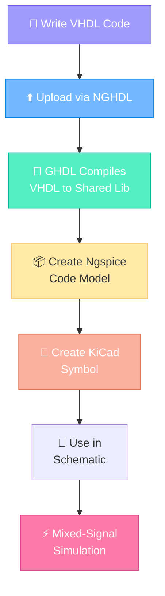

<p align="center">
  
</p>

<h1 align="center">eSim — Electronic Circuit Simulation</h1>

<p align="center">
  <strong>An Open-Source EDA Tool for Circuit Design, Simulation, Analysis & PCB Design</strong><br/>
  <em>Developed by <a href="https://www.fossee.in/">FOSSEE Team</a> at <a href="https://www.iitb.ac.in/">IIT Bombay</a></em>
</p>

<p align="center">
  <a href="https://github.com/fossee/esim/releases"></a>
  <a href="https://github.com/fossee/esim/blob/master/LICENSE"></a>
  <a href="https://www.python.org/"></a>
  <a href="https://doc.qt.io/qtforpython-6/"></a>
</p>

<p align="center">
  <a href="https://esim.readthedocs.io/en/latest/?badge=latest"></a>
  <a href="https://github.com/fossee/esim/network"></a>
  <a href="https://github.com/fossee/esim/stargazers"></a>
  <a href="https://github.com/fossee/esim/issues"></a>
  <a href="https://github.com/fossee/esim"></a>
  <a href="https://github.com/fossee/esim/graphs/contributors"></a>
  <a href="https://www.python.org/dev/peps/pep-0008/"></a>
</p>

<p align="center">
  <a href="#-features">Features</a> •
  <a href="#%EF%B8%8F-architecture">Architecture</a> •
  <a href="#-installation">Installation</a> •
  <a href="#-project-structure">Project Structure</a> •
  <a href="#-tech-stack">Tech Stack</a> •
  <a href="#-contributing">Contributing</a> •
  <a href="#-license">License</a>
</p>

---

## 📖 About

**eSim** is a free and open-source EDA (Electronic Design Automation) tool for circuit design, simulation, analysis, and PCB design. It is an integrated tool built using open-source software such as **KiCad**, **Ngspice**, **GHDL**, and **Makerchip**, providing a seamless workflow from schematic capture to simulation results.

eSim is designed for electronics engineers, students, educators, and hobbyists who want a powerful yet cost-free alternative to proprietary EDA tools. It supports analog, digital, and **mixed-signal simulations**, including microcontroller integration.

> 📥 **Download**: [esim.fossee.in/downloads](https://esim.fossee.in/downloads) &nbsp;|&nbsp; 📄 **User Manual**: [eSim Manual v2.5 (PDF)](https://static.fossee.in/esim/manuals/eSim_Manual_2.5.pdf) &nbsp;|&nbsp; 📚 **Developer Docs**: [esim.readthedocs.io](https://esim.readthedocs.io/en/latest/)

---

## ✨ Features

| Category | Feature | Description |
|:---------|:--------|:------------|
| 🎨 **Design** | Schematic Capture | Draw circuit schematics using KiCad's schematic editor with eSim's custom symbol libraries |
| 🔄 **Conversion** | KiCad to Ngspice | Convert KiCad schematics to Ngspice-compatible netlists for simulation |
| ⚡ **Simulation** | Ngspice Engine | Run DC, AC, Transient, and other SPICE analyses with real-time interactive plots |
| 📊 **Analysis** | Waveform Plotting | Visualize simulation results with matplotlib-based Python plots and Ngspice native plots |
| 🔧 **Model Editor** | Device Models | Create and edit SPICE device models (Diodes, BJTs, MOSFETs, JFETs, IGBTs, etc.) |
| 🧩 **Subcircuits** | Subcircuit Builder | Build, manage, and upload reusable subcircuit blocks |
| 🖥️ **Mixed-Signal** | NGHDL Integration | Interface VHDL digital models (via GHDL) with analog Ngspice simulations |
| 🌐 **Verilog** | Makerchip + NgVeri | Use Makerchip IDE for Verilog/TL-Verilog design and convert to Ngspice models |
| 🏭 **PCB** | Layout Design | Design PCB layouts using KiCad's PCB editor with eSim's footprint libraries |
| 🔁 **Converters** | Schematic Import | Convert PSpice and LTSpice schematics/libraries to KiCad-compatible formats |
| 📐 **Modelica** | Ngspice-to-Modelica | Convert Ngspice netlists to Modelica models for OpenModelica simulation |
| 🏗️ **SKY130 PDK** | SkyWater 130nm | Support for SkyWater SKY130 open-source Process Design Kit |
| 🔬 **IHP PDK** | IHP OpenPDK | Integration with IHP SG13G2 open-source PDK for SiGe BiCMOS |

---

## 🏗️ Architecture

### High-Level System Architecture



### Simulation Workflow



### Mixed-Signal Simulation Flow (NGHDL)



---

## 📂 Project Structure

### Root Directory

| Path | Type | Description |
|:-----|:-----|:------------|
| `src/` | 📁 Directory | **Core application source code** — all Python modules for the eSim GUI and backend |
| `library/` | 📁 Directory | **Component libraries** — device models, KiCad symbols, subcircuits, and PDK data |
| `nghdl/` | 📁 Directory | **NGHDL module** — Ngspice-GHDL interface for mixed-signal VHDL simulation |
| `Examples/` | 📁 Directory | **42 example projects** — ready-to-simulate circuits (RC, BJT, Op-Amp, Mixed-Signal, etc.) |
| `images/` | 📁 Directory | **UI assets** — application icons, toolbar images, logos, and splash screen |
| `scripts/` | 📁 Directory | **Launch & setup scripts** — shell scripts for Linux installation and launching |
| `docs/` | 📁 Directory | **Sphinx documentation** — RST files for ReadTheDocs auto-generated developer docs |
| `code/` | 📁 Directory | **Sphinx autodoc config** — mirrors `src/` structure for API documentation generation |
| `flatpak/` | 📁 Directory | **Flatpak packaging** — manifest and wrapper scripts for universal Linux distribution |
| `appimage/` | 📁 Directory | **AppImage packaging** — build scripts for portable Linux AppImage bundles |
| `docker-launcher/` | 📁 Directory | **Docker support** — Dockerfile, launcher script, and CI workflows for containerized builds |
| `snap/` | 📁 Directory | **Snap packaging** — `snapcraft.yaml` for building Snap packages |
| `ihp/` | 📁 Directory | **IHP PDK integration** — install script for IHP SG13G2 open-source SiGe BiCMOS PDK |
| `patches/` | 📁 Directory | **Source patches** — patch files for modifying Ngspice/GHDL behavior in sandboxed environments |
| `.github/` | 📁 Directory | **GitHub config** — issue templates, PR templates, and CI/CD workflow definitions |
| `setup.py` | 📄 File | Python package configuration for pip installation |
| `requirements.txt` | 📄 File | Python dependency list (PyQt6, matplotlib, numpy, scipy, etc.) |
| `conf.py` | 📄 File | Sphinx documentation configuration |
| `VERSION` | 📄 File | Current version identifier (`2.5`) |
| `INSTALL` | 📄 File | Detailed multi-platform installation instructions |
| `LICENSE` | 📄 File | GNU General Public License v3.0 |

### Source Code (`src/`) — Detailed Module Breakdown

```
src/
├── frontEnd/               # 🖥️ GUI & Main Application
│   ├── Application.py      # Main window, toolbar setup, menu actions (960 lines)
│   ├── DockArea.py          # Tabbed dock workspace for editors/simulators (24K)
│   ├── ProjectExplorer.py   # File tree browser for project navigation (20K)
│   ├── TimeExplorer.py      # Project snapshot/version management (8K)
│   ├── TerminalUi.py        # Embedded terminal widget (5K)
│   └── Workspace.py         # Workspace selection dialog (6K)
│
├── kicadtoNgspice/          # 🔄 KiCad-to-Ngspice Conversion Engine
│   ├── KicadtoNgspice.py    # Main conversion controller & UI (41K)
│   ├── Convert.py           # Netlist parsing and SPICE generation (40K)
│   ├── Analysis.py          # Analysis type configuration (DC, AC, Transient) (32K)
│   ├── DeviceModel.py       # Device model parameter handling (56K)
│   ├── Source.py             # Source component configuration (15K)
│   ├── Processing.py         # Netlist processing pipeline (26K)
│   ├── SubcircuitTab.py      # Subcircuit selection in converter (9K)
│   ├── Microcontroller.py    # Microcontroller model support (10K)
│   ├── Model.py              # Model file handling (6K)
│   └── TrackWidget.py        # UI tracking widget (1K)
│
├── ngspiceSimulation/       # ⚡ Simulation Engine & Plotting
│   ├── NgspiceWidget.py     # Ngspice process management & execution (16K)
│   ├── plot_window.py       # matplotlib-based waveform plotter (66K)
│   ├── plotting_widgets.py  # Custom plot controls and widgets (8K)
│   └── data_extraction.py   # Simulation data file parser (11K)
│
├── modelEditor/             # 🔧 SPICE Model Editor
│   └── ModelEditor.py       # GUI for creating/editing device models (33K)
│
├── subcircuit/              # 🧩 Subcircuit Management
│   ├── Subcircuit.py        # Subcircuit manager main window (3K)
│   ├── newSub.py            # Create new subcircuit (3K)
│   ├── openSub.py           # Open existing subcircuit (1K)
│   ├── uploadSub.py         # Upload subcircuit to library (4K)
│   └── convertSub.py        # Subcircuit format conversion (2K)
│
├── maker/                   # 🌐 Makerchip & NgVeri Integration
│   ├── Maker.py             # Makerchip IDE integration (23K)
│   ├── NgVeri.py            # Verilog-to-Ngspice model generator (17K)
│   ├── ModelGeneration.py   # Auto model generation pipeline (48K)
│   ├── createkicad.py       # KiCad symbol creation for models (14K)
│   ├── makerchip.py         # Makerchip cloud IDE connector (3K)
│   └── Appconfig.py         # Maker-specific configuration (2K)
│
├── converter/               # 🔁 Schematic Format Converters
│   ├── pspiceToKicad.py     # PSpice schematic importer (5K)
│   ├── ltspiceToKicad.py    # LTSpice schematic importer (6K)
│   ├── libConverter.py      # Library format converter (3K)
│   ├── LtspiceLibConverter.py # LTSpice library converter (4K)
│   ├── browseSchematic.py   # File browser for schematics (550B)
│   ├── LTSpiceToKiCadConverter/ # LTSpice conversion engine
│   └── schematic_converters/    # Additional schematic parsers
│
├── ngspicetoModelica/       # 📐 Ngspice-to-Modelica Converter
│   ├── NgspicetoModelica.py # Core conversion engine (54K)
│   └── ModelicaUI.py        # Modelica converter GUI (10K)
│
├── configuration/           # ⚙️ Application Configuration
│   └── Appconfig.py         # Global config, paths, process tracking (4K)
│
├── projManagement/          # 📋 Project Management
│   ├── Kicad.py             # KiCad integration (launch schematic/PCB editor) (9K)
│   ├── Validation.py        # Tool and file validation utilities (7K)
│   ├── Worker.py            # Background process/thread management (3K)
│   ├── newProject.py        # New project creation logic (5K)
│   └── openProject.py       # Open existing project logic (3K)
│
└── browser/                 # 📖 Help & Documentation
    ├── Welcome.py           # Welcome screen display (941B)
    └── UserManual.py        # User manual viewer (731B)
```

### Library Directory (`library/`) — Component Libraries

| Path | Description |
|:-----|:------------|
| `deviceModelLibrary/` | SPICE device models organized by type: Diode, BJT (Transistor), MOSFET (MOS), JFET, IGBT, LEDs, Switches, Transmission Lines, and user libraries |
| `kicadLibrary/` | KiCad schematic symbols (`eSim-symbols/`), footprint libraries (`kicad_eSim-Library/`), and project templates |
| `SubcircuitLibrary/` | Reusable subcircuit definitions for common circuit blocks |
| `modelParamXML/` | XML parameter definitions for device model editor forms |
| `ngspicetoModelica/` | Mapping files for Ngspice-to-Modelica component translation |
| `browser/` | HTML/resource files for the built-in help browser |
| `tlv/` | TL-Verilog support files for Makerchip integration |

### NGHDL Module (`nghdl/`) — Mixed-Signal Interface

| Path | Description |
|:-----|:------------|
| `src/ngspice_ghdl.py` | Core interface: manages VHDL upload, GHDL compilation, and Ngspice code model creation |
| `src/model_generation.py` | Generates C code models from VHDL port definitions for Ngspice |
| `src/createKicadLibrary.py` | Auto-generates KiCad symbols from VHDL entity definitions |
| `src/ghdlserver/` | GHDL foreign interface server for inter-process communication with Ngspice |
| `install-nghdl.sh` | Automated installer for NGHDL dependencies (GHDL, Verilator, Ngspice) |
| `Example/` | Example VHDL models and mixed-signal simulation projects |

---

## 🛠️ Tech Stack

| Layer | Technology | Purpose |
|:------|:-----------|:--------|
| **Language** |  | Core application logic |
| **GUI Framework** |  | Desktop GUI (windows, dialogs, toolbars, docks) |
| **Plotting** |  | Waveform visualization and data plotting |
| **Numerics** |   | Numerical computation and signal processing |
| **Schematic & PCB** |  | Schematic capture and PCB layout design |
| **SPICE Simulation** |  | Analog/mixed-signal circuit simulation engine |
| **VHDL Simulation** |  | VHDL analysis, compilation, and simulation |
| **Verilog** |  | Verilog HDL simulation and model generation |
| **HDL Cloud IDE** |  | Online Verilog/TL-Verilog IDE integration |
| **Modelica** |  | Multi-domain modeling and simulation |
| **PDK** |  | SkyWater 130nm open-source process design kit |
| **Packaging** |   | Cross-distribution Linux packaging & containers |
| **Documentation** |   | Auto-generated developer documentation |
| **CI/CD** |  | Automated builds, Docker images, and releases |

### Key Python Dependencies

| Package | Version | Purpose |
|:--------|:--------|:--------|
| `PyQt6` | ≥ 6.5.0 | GUI framework |
| `matplotlib` | 3.7.5 | Waveform plotting |
| `numpy` | 1.24.4 | Numerical computation |
| `scipy` | 1.10.1 | Scientific computing |
| `pillow` | 12.2.0 | Image processing |
| `hdlparse` | 1.0.4 | HDL file parsing |
| `watchdog` | 4.0.2 | File system monitoring |
| `pyparsing` | 3.1.4 | Parser building toolkit |

---

## 💻 Installation

### Supported Platforms

| Platform | Method | Status |
|:---------|:-------|:------:|
| **All Linux** (Fedora, Ubuntu, openSUSE, Arch, etc.) | Flatpak | ✅ Recommended |
| **Ubuntu** 22.04 / 23.04 / 24.04 LTS | Native Installer | ✅ Supported |
| **Windows** 8 / 10 / 11 | Windows Installer | ✅ Supported |
| **Docker** (any OS) | Docker Container | ✅ Supported |

### 🐧 Linux — Flatpak (Recommended for all distributions)

```bash
# 1. Install Flatpak (if not already installed)
# Fedora:    sudo dnf install flatpak
# Ubuntu:    sudo apt install flatpak
# openSUSE:  sudo zypper install flatpak
# Arch:      sudo pacman -S flatpak

# 2. Add Flathub repository
flatpak remote-add --if-not-exists flathub https://dl.flathub.org/repo/flathub.flatpakrepo

# 3. Install eSim
flatpak install flathub org.fossee.eSim

# 4. Run eSim
flatpak run org.fossee.eSim
```

> **⚠️ Flatpak Limitations:** NGHDL, Makerchip, and SKY130 PDK are not included in the Flatpak build. For full mixed-signal support, use the Ubuntu native installer.

### 🐧 Ubuntu — Native Installer

```bash
# 1. Download and extract eSim
unzip eSim-2.5.zip
cd eSim-2.5

# 2. Install eSim with all dependencies
chmod +x install-eSim.sh
./install-eSim.sh --install

# 3. Run eSim
esim
# Or double-click the eSim desktop icon
```

### 🪟 Windows

1. Download the eSim installer from [esim.fossee.in/downloads](https://esim.fossee.in/downloads)
2. Disable antivirus temporarily (if required)
3. **Important:** Remove MinGW/MSYS from the PATH environment variable if previously installed
4. Run the installer and follow the on-screen instructions
5. Launch eSim from the Start Menu or desktop shortcut

### 🐋 Docker

Refer to the [Docker Launcher README](docker-launcher/README.md) for instructions on running eSim in a containerized environment.

### 📦 Build from Source (Flatpak)

```bash
cd eSim
flatpak-builder build flatpak/org.fossee.eSim.yml --install --user
```

> 📖 For comprehensive installation instructions, see the [INSTALL](INSTALL) file.

---

## 🔄 CI/CD & Packaging

| Workflow | File | Purpose |
|:---------|:-----|:--------|
| Docker Image Build | `.github/workflows/docker-image.yml` | Builds and publishes the eSim Docker image |
| Docker Launcher Build | `.github/workflows/docker-launcher-build.yml` | Builds the cross-platform Python launcher |
| Ubuntu Release | `.github/workflows/release_ubuntu.yml` | Automated Ubuntu `.deb` package builds |

| Packaging Format | Directory | Description |
|:-----------------|:----------|:------------|
| Flatpak | `flatpak/` | Universal Linux package via Flathub |
| AppImage | `appimage/` | Portable single-file Linux executable |
| Snap | `snap/` | Ubuntu Snap Store package |
| Docker | `docker-launcher/` | Containerized distribution with GUI forwarding |

---

## 📋 Example Projects

eSim ships with **42 ready-to-simulate example projects** in the `Examples/` directory:

<details>
<summary><b>📂 Click to expand full example list</b></summary>

| # | Category | Example | Description |
|:-:|:---------|:--------|:------------|
| 1 | 🔌 Basic | `RC` | RC circuit transient analysis |
| 2 | 🔌 Basic | `RL` | RL circuit transient analysis |
| 3 | 🔌 Basic | `RLC` | RLC circuit resonance analysis |
| 4 | 🔌 Basic | `Series_Resonance` | Series RLC resonance |
| 5 | 🔌 Basic | `Parallel_Resonance` | Parallel RLC resonance |
| 6 | 💡 Diodes | `Diode_characteristics` | Diode I-V characteristics |
| 7 | 💡 Diodes | `Halfwave_Rectifier` | Half-wave rectifier circuit |
| 8 | 💡 Diodes | `Fullwavebridgerectifier` | Full-wave bridge rectifier |
| 9 | 💡 Diodes | `Clippercircuit` | Diode clipper circuit |
| 10 | 💡 Diodes | `Clampercircuit` | Diode clamper circuit |
| 11 | 💡 Diodes | `Zener_Characteristic` | Zener diode characteristics |
| 12 | 🔋 BJT | `BJT_CE_config` | BJT common-emitter configuration |
| 13 | 🔋 BJT | `BJT_CB_config` | BJT common-base configuration |
| 14 | 🔋 BJT | `BJT_amplifier` | BJT amplifier circuit |
| 15 | 🔋 BJT | `BJT_Biascircuit` | BJT bias circuit design |
| 16 | 🔋 BJT | `BJT_Frequency_Response` | BJT frequency response analysis |
| 17 | 📟 FET | `FET_Characteristic` | FET output characteristics |
| 18 | 📟 FET | `FET_Amplifier` | FET amplifier circuit |
| 19 | 📟 FET | `FrequencyResponse_JFET` | JFET frequency response |
| 20 | 🎛️ Op-Amp | `InvertingAmplifier` | Op-amp inverting amplifier (LM741) |
| 21 | 🎛️ Op-Amp | `Differentiator` | Op-amp differentiator circuit |
| 22 | 🎛️ Op-Amp | `Integrator_LM_741` | Op-amp integrator |
| 23 | 🎛️ Op-Amp | `Precision_Rectifiers_using_LM741` | Precision rectifier circuits |
| 24 | 🔲 Digital | `BasicGates` | Basic logic gates |
| 25 | 🔲 Digital | `Half_Adder` | Half-adder circuit |
| 26 | 🔲 Digital | `FullAdder` | Full-adder circuit |
| 27 | 🔲 Digital | `JK_Flipflop` | JK flip-flop circuit |
| 28 | 🔲 Digital | `4_bit_JK_ff` | 4-bit JK flip-flop counter |
| 29 | 🔲 Digital | `CMOS_NAND_Gate` | CMOS NAND gate |
| 30 | 🔲 Digital | `Analysis_Of_Digital_IC` | Digital IC analysis |
| 31 | ⏱️ Timers | `Astable555` | 555 timer astable mode |
| 32 | ⏱️ Timers | `Monostable555` | 555 timer monostable mode |
| 33 | 🔁 SCR | `HalfwaveRectifier_SCR` | SCR half-wave rectifier |
| 34 | 🔁 SCR | `FullwaveRectifier_SCR` | SCR full-wave rectifier |
| 35 | 📡 Filters | `High_Pass_Filter` | High-pass filter design |
| 36 | 📡 Filters | `Low_Pass_Filter` | Low-pass filter design |
| 37 | ⚡ Regulators | `7805VoltageRegulator` | 7805 voltage regulator |
| 38 | ⚡ Regulators | `7812VoltageRegulator` | 7812 voltage regulator |
| 39 | 🌀 Oscillators | `UJT_Relaxation_Oscillator` | UJT relaxation oscillator |
| 40 | 🌀 Oscillators | `Phase_Locked_Loop` | PLL circuit |
| 41 | 🔀 Mixed-Signal | `Mixed_Signal` | Mixed analog-digital simulation (NGHDL) |
| 42 | 🔌 Power | `Transformer` | Transformer circuit analysis |

</details>

---

## 🤝 Contributing

We welcome contributions from the community! Whether it's bug fixes, new features, documentation improvements, or example circuits — every contribution matters.

### How to Contribute


1. **Fork** the repository to your GitHub account
2. **Clone** your fork:
   ```bash
   git clone https://github.com/<your-username>/eSim.git
   ```
3. **Create a new branch** for your changes:
   ```bash
   git checkout -b feature/your-feature-name
   ```
4. **Make your changes** and commit with a descriptive message:
   ```bash
   git add <files>
   git commit -m "Fixes issue #<number> - Brief description of changes"
   ```
5. **Push** to your fork and **open a Pull Request**:
   ```bash
   git push origin feature/your-feature-name
   ```

> **📌 Guidelines:**
> - Each PR should reference an existing issue
> - One commit per pull request (squash if needed)
> - Follow [PEP 8](https://www.python.org/dev/peps/pep-0008/) code style
> - Include a commit body describing what you changed and why

For detailed contribution guidelines, see [CONTRIBUTION.md](CONTRIBUTION.md).

---

## 👥 Top Contributors

A huge thank you to all the amazing people who have contributed to eSim! 🎉

| # | Contributor | Commits | GitHub Profile |
|:-:|:------------|:-------:|:---------------|
| 🥇 | **Sumanto Kar** | 280 | [](https://github.com/Eyantra698Sumanto) |
| 🥈 | **Rahul Paknikar** | 262 | [](https://github.com/rahulp13) |
| 🥉 | **Fahim Khan** | 244 | [](https://github.com/fahim-oscad) |
| 4 | **Saurabh Bansod** | 46 | [](https://github.com/saurabhb17) |
| 5 | **Athul George** | 37 | [](https://github.com/athulappadan) |
| 6 | **Nil Shah** | 36 | [](https://github.com/nilshah98) |
| 7 | **Pranav P** | 34 | [](https://github.com/pranavsdreams) |
| 8 | **Annesha Dey** | 33 | [](https://github.com/AD20047) |
| 9 | **Sunil Shetye** | 33 | [](https://github.com/sunilshetye) |
| 10 | **Anjali Jaiswal** | 32 | [](https://github.com/anjalijaiswal08) |
| 11 | **Hariom Thakur** | 28 | [](https://github.com/hariom) |
| 12 | **Shanthi Priya** | 24 | [](https://github.com/shanthipriya) |
| 13 | **Aditya Minocha** | 23 | [](https://github.com/adityaminocha) |
| 14 | **Ganderla Chaithanya** | 22 | [](https://github.com/GanderlaChaithanya) |
| 15 | **Anwesha** | 21 | [](https://github.com/Anwesha06) |

<p align="center">
  <a href="https://github.com/fossee/esim/graphs/contributors">
    
  </a>
</p>

<p align="center"><em>149+ contributors and counting! <a href="https://github.com/fossee/esim/graphs/contributors">View all →</a></em></p>

---

## 📞 Contact & Support

| Channel | Link |
|:--------|:-----|
| 📧 **Email** | [contact-esim@fossee.in](mailto:contact-esim@fossee.in) |
| 🌐 **Website** | [esim.fossee.in](https://esim.fossee.in/) |
| 💬 **Forum** | [forums.fossee.in](https://forums.fossee.in/) |
| 📞 **Contact Page** | [esim.fossee.in/contact-us](https://esim.fossee.in/contact-us) |
| 📄 **User Manual** | [eSim Manual v2.5 (PDF)](https://static.fossee.in/esim/manuals/eSim_Manual_2.5.pdf) |
| 📚 **Developer Docs** | [esim.readthedocs.io](https://esim.readthedocs.io/en/latest/) |

---

## 🔒 Security

For information on reporting security vulnerabilities, please see [SECURITY.md](SECURITY.md).

---

## 📄 License

eSim is released under the **GNU General Public License v3.0** — see the [LICENSE](LICENSE) file for details.

```
Copyright (C) FOSSEE, IIT Bombay

This program is free software: you can redistribute it and/or modify
it under the terms of the GNU General Public License as published by
the Free Software Foundation, either version 3 of the License, or
(at your option) any later version.
```

---

<p align="center">
  <strong>Built with ❤️ by the <a href="https://www.fossee.in/">FOSSEE Team</a> at <a href="https://www.iitb.ac.in/">IIT Bombay</a></strong>
</p>

<p align="center">
  <a href="https://esim.fossee.in/">
    
  </a>
  &nbsp;&nbsp;&nbsp;&nbsp;
  <a href="https://www.iitb.ac.in/">
    
  </a>
</p>

<p align="center">
  <sub>⭐ If you find eSim useful, consider giving it a star on GitHub!</sub>
</p>
