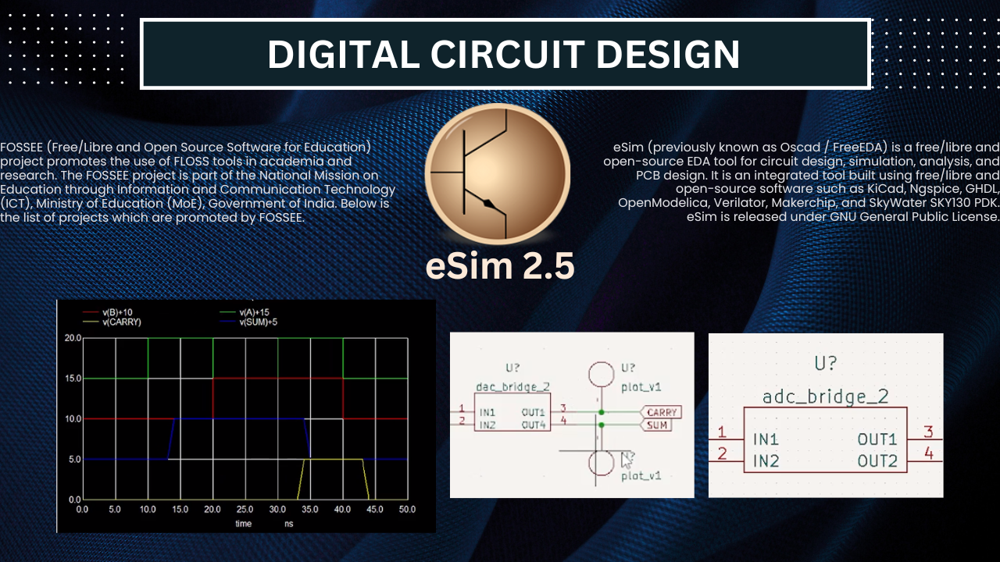

<h1 align="center">eSim EDA Query Solutions</h1>
<h3 align="center">Solutions for Common eSim User Queries</h3>

---

## About

This repository contains **Solutions to common queries related to eSim EDA**.  
Each solution is organized into folders based on the topic or issue.

The purpose of this repository is to make it easier for users to **find explanations and troubleshooting guides** through short demonstration videos.

---

<!-- SECTION 1: Step-by-Step Prerequisite -->
<h4>📌 Step-by-Step Prerequisite</h4>
<table>
<tr>
<td align="center">

 <b>How to Create a Contributor Account</b>
</td>
</tr>
</table>

<!-- SECTION 2: Core eSim Operations -->
<h4>📌 Core eSim Operations </h4>
<table>
<tr>
<td align="center">

 <b>How to Select the Workspace</b>
</td>

<td align="center">

 <b>How to Create a Subcircuit</b>
</td>

<td align="center">

 <b>How to Use the Symbol Editor</b>
</td>
</tr>

<tr>
<td align="center">

 <b>How to Create a Test Circuit Environment</b>
</td>

<td align="center">

 <b>How to Set Parameters</b>
</td>

</tr>
</table>

<!-- SECTION 3: Independent Design Example -->
<h4>📌 Design Example</h4>
<table>
<tr>
<td align="center">

 <b>Digital Circuit Design</b>
</td>
</tr>
</table>

<!-- SECTION 4: Settings & Troubleshooting -->
<h4>📌 Settings & Troubleshooting </h4>
<table>
<tr>
<td align="center">

 <b>How to Set Graphic Preferences</b>
</td>
</tr>
</table>

---

New query solutions will be added over time.

📧 <b>To get your question's answer, write to us at</b> 
<a href="mailto:contact-esim@fossee.in?subject=eSim-EDA-QnA">
<strong>contact-esim@fossee.in</strong>
</a> 
<b>with subject line:</b> <code style="background-color: #f0f0f0; padding: 2px 8px; border-radius: 4px;">eSim-EDA-QnA</code>

