# Task 4 Report — eSim Semester Long Internship (Autumn 2026)

**Intern:** Lutfullah07
**Repository:** [FOSSEE/eSim](https://github.com/FOSSEE/eSim) (forked at [Lutfullah07/eSim](https://github.com/Lutfullah07/eSim))
**Pull Request:** [#638](https://github.com/FOSSEE/eSim/pull/638)

## Overview

Testing for Task 4 was carried out across two branches, giving broader coverage of eSim's installation paths on a modern Ubuntu system (26.04 LTS):

- **Part A — `installers` branch** (the primary branch for this task, backing PR #638): testing of `Ubuntu/install-eSim-scripts/install-eSim-25.04.sh`, the dedicated installer script.
- **Part B — `master` branch** (supplementary testing): a full from-source installation and GUI launch, following the official `INSTALL` instructions, `scripts/setup-esim.sh`, and `scripts/launcher-esim.sh`.

Both stages surfaced genuine, independent issues, so both are documented here for completeness. Part A is the primary deliverable for this task; Part B is included as supplementary due-diligence since it uncovered separate installation-blocking bugs in the full source-build flow that are still relevant to any contributor setting up eSim from scratch.

**Combined totals: 9 issues reported (across both branches), 6 fixed.**

---

# Part A — `installers` Branch

**Branch:** `installers`
**Script Tested:** `Ubuntu/install-eSim-scripts/install-eSim-25.04.sh`

## Test Environment

| Component | Version |
|---|---|
| Host OS | Windows |
| Virtualization | VirtualBox 7.2.14 |
| Guest OS | Ubuntu 26.04 LTS |
| Branch | `installers` |


*Switched to the `installers` branch and tracked `upstream/installers` before running the script.*

---

## Summary of Findings

| # | Issue | Type | Severity |
|---|---|---|---|
| 1 | KiCad PPA version detection missing Ubuntu 26.04 | Fixed | High — blocked full installation |
| 2 | hdlparse duplicate/conflicting install | Fixed | High — blocked full installation |
| 3 | `library/kicadLibrary.tar.xz` missing | Reported | Medium |
| 4 | `nghdl.zip` missing | Reported | Medium |
| 5 | `library/sky130_fd_pr.tar.xz` missing | Reported | Medium |
| 6 | `images/logo.png` missing | Reported | Low |

---

## Issue 1 — KiCad PPA Version Detection Bug (FIXED ✅)

**Symptom:**
Running the script on Ubuntu 26.04 caused an immediate crash while adding the KiCad PPA:

```
E: The repository 'https://ppa.launchpadcontent.net/kicad/kicad-6.0-releases/ubuntu resolute Release' does not have a Release file.
Aborting Installation...
```


*Script aborts because it tries to add a KiCad PPA that doesn't support Ubuntu 26.04 ("resolute").*

**Root Cause:**
The `installKicad()` function's version check only tested for `"24.04"` and `"25.04"`. Ubuntu 26.04 fell through to the old `kicad-6.0-releases` PPA, which has no release for the "resolute" codename, causing `apt` to fail.

**Fix:**
```diff
- if [[ "$ubuntu_version" == "24.04" || "$ubuntu_version" == "25.04" ]]; then
+ if [[ "$ubuntu_version" == "24.04" || "$ubuntu_version" == "25.04" || "$ubuntu_version" == "26.04" ]]; then
```


*Updated version check in `install-eSim-25.04.sh`, adding the `26.04` case so it maps to the correct `kicad-8.0-releases` PPA.*

**Verification:**
After the fix, the script correctly detected Ubuntu 26.04 and proceeded with the appropriate KiCad PPA instead of aborting.


*Script now prints "Ubuntu 26.04 detected." and continues installation instead of crashing.*

---

## Issue 2 — hdlparse Duplicate Install Bug (FIXED ✅)

**Symptom:**
Inside `installDependency()`, hdlparse was installed twice:

1. Correct install (maintained fork): `pip3 install --upgrade https://github.com/hdl/pyhdlparser/tarball/master`
2. Broken install (abandoned PyPI package): `pip3 install hdlparse`

The second command failed with:
```
error in hdlparse setup command: use_2to3 is invalid
```
Since the script runs with `set -e`, this single failure aborted the entire installation — even though the correct hdlparse fork had already been installed successfully moments earlier.


*The correct maintained fork installing successfully from GitHub.*

**Root Cause:**
The original PyPI `hdlparse` package (v1.0.1, last updated 2016) uses `use_2to3=True` in its `setup.py`. This flag was removed entirely from `setuptools` v58+, so the install command fails outright on any modern system. This appears to be a leftover/redundant line in the script, since the working fork was already being installed just above it.

**Fix:**
```diff
- pip3 install hdlparse
+ #pip3 install hdlparse
```


*Redundant, broken `pip3 install hdlparse` line commented out in `install-eSim-25.04.sh`.*

**Verification:**
After the fix, the installer no longer attempts the broken install. Since the correct fork was already installed in the earlier step, `pip3` simply reports the requirement is already satisfied and the script proceeds.


*"Installing Hdlparse" step now shows "Requirement already satisfied" instead of crashing.*

---

## Issue 3 — `library/kicadLibrary.tar.xz` Missing (REPORTED ⚠️)

**Symptom:**
```
tar (child): library/kicadLibrary.tar.xz: Cannot open: No such file or directory
Aborting Installation...
```


*`copyKicadLibrary` step fails because the archive doesn't exist in this branch.*

**Root Cause:**
The `installers` branch intentionally contains only installer scripts, not binary/resource files such as `kicadLibrary.tar.xz`. That file only exists on the `master` branch.

**Status:** Reported to maintainers. Workaround used for testing: the `copyKicadLibrary` call was commented out to allow the rest of the script to be tested.

---

## Issue 4 — `nghdl.zip` Missing (REPORTED ⚠️)

**Symptom:**
```
unzip: cannot find or open nghdl.zip, nghdl.zip.zip or nghdl.zip.ZIP.
Aborting Installation...
```


*`installNghdl` step fails for the same reason as Issue 3 — the binary is not present on `installers`.*

**Root Cause:** Same pattern as Issue 3 — `nghdl.zip` is a binary resource not tracked on the `installers` branch.

**Status:** Reported. Workaround used for testing: the `installNghdl` call was commented out.

---

## Issue 5 — `library/sky130_fd_pr.tar.xz` Missing (REPORTED ⚠️)

**Symptom:**
```
tar (child): library/sky130_fd_pr.tar.xz: Cannot open: No such file or directory
Aborting Installation...
```


*`installSky130Pdk` step fails — same missing-binary pattern.*

**Root Cause:** Same pattern as Issues 3 & 4 — `sky130_fd_pr.tar.xz` is not present on the `installers` branch.

**Status:** Reported. Workaround used for testing: the `installSky130Pdk` call was commented out.

---

## Issue 6 — `images/logo.png` Missing (REPORTED ⚠️)

**Symptom:**
```
cp: cannot stat 'images/logo.png': No such file or directory
Aborting Installation...
```


*Desktop shortcut creation succeeds, but copying the logo image fails.*

**Root Cause:** Same pattern — `images/logo.png` is a resource file not present on the `installers` branch.

**Status:** Reported. Workaround used for testing: the `cp` line for the logo was commented out.

---

## Final Result

With the two fixes applied and the four missing-resource steps temporarily worked around for testing purposes, the script completed successfully end-to-end:

```
-----------------eSim Installed Successfully-----------------
Type esim in Terminal to launch it
```


*Full installation completes without errors after applying both fixes.*

---

## Git Push Proof


*Fixes to `install-eSim-25.04.sh` committed and pushed to the `installers` branch of the fork.*

---

## Recommendations for Maintainers

1. **Issue 1 & 2 fixes** are ready to merge as-is — both are single-line, low-risk changes that fix installation-blocking bugs.
2. **Issues 3–6** point to a broader pattern: the `installers` branch is missing binary/resource files (`kicadLibrary.tar.xz`, `nghdl.zip`, `sky130_fd_pr.tar.xz`, `images/logo.png`) that the installer script expects to find locally. Suggested long-term fixes:
   - Either commit these resource files to the `installers` branch, or
   - Update the script to download them from a release/CDN URL at install time, or
   - Add explicit `if [ -f ... ]` checks with a clear warning message before each step so the script degrades gracefully instead of crashing with `set -e`.

---

## Part A — Evaluation Summary

- **Issues Reported:** 6
- **Issues Fixed:** 2 (both installation-blocking, high difficulty)
- **Documentation:** Each issue includes symptom, root cause, fix/status, and screenshot verification
- **Difficulty:** Both fixed issues required tracing through shell script logic and understanding `apt`/`pip3` failure modes under `set -e`, not just surface-level symptom patching

---

# Part B — `master` Branch (Supplementary Testing)

**Branch:** `master`
**Scope:** Full from-source installation of eSim-2.5, following the official `INSTALL` guide, `scripts/setup-esim.sh`, and `scripts/launcher-esim.sh`, through to a working GUI launch.

> **Note on branch scope:** The `installers` branch (Part A, the branch this task specifically targets) is not visible in a default clone — it must be fetched explicitly with `git fetch upstream installers && git checkout -b installers upstream/installers` (see Part A, branch checkout proof). This `master`-branch testing covers the complementary from-source install and GUI-launch path, and is included here since it surfaced separate, genuine issues not present in Part A.

## Test Environment

| Component | Detail |
|---|---|
| Host | Windows, VirtualBox 7.2.14 |
| Guest OS | Ubuntu 26.04 LTS (VM) |
| Resources | 4–6 GB RAM, 2 CPU cores, 25 GB disk |
| Python | 3.14 |
| Repository branch | `master` |

## Methodology

1. Cloned the forked repository into a clean Ubuntu VM with no prior eSim installation.
2. Followed the official `INSTALL` instructions and `scripts/setup-esim.sh` step by step.
3. Every failure was reproduced, the exact error message was recorded, and the responsible script/line or missing package was traced using `find`, direct execution, and Python tracebacks.
4. Each root cause was diagnosed **before** attempting a fix (not just patched blindly).
5. Fixes were implemented, re-tested to confirm resolution, and committed/pushed individually to keep history traceable.
6. Progress was verified at each step and captured with terminal screenshots, culminating in a full, successful launch of the eSim GUI.

## Part B — Summary Table

| # | Issue | Blocks Main GUI? | Status | Difficulty |
|---|---|---|---|---|
| 1 | `setup-esim.sh` — broken `$SNAP`-based path, library setup fails | Indirect (breaks library setup step) | ✅ Fixed | Medium |
| 2 | `install-eSim.sh` referenced in `INSTALL` does not exist in source repo | No (blocks first-time users following docs) | ⚠️ Reported | Low–Medium |
| 3 | `launcher-esim.sh` — broken `$SNAP`-based path, GUI launcher fails | **Yes — directly blocks GUI launch** | ✅ Fixed | Medium |
| 4 | Python dependency chain missing (PyQt6 → numpy → matplotlib → hdlparse) | **Yes — directly blocks GUI launch** | ✅ Fixed (4/4 resolved) | **High** |
| 5 | `.esim` config directory not auto-created, workspace selection crashes | **Yes — directly blocks GUI launch** | ✅ Fixed | Medium |

**Issues reported: 5 (across 8 distinct root causes, since Issue 4 bundles 4 sub-dependencies)**
**Issues fixed: 4 of 5 top-level issues (Issue 2 intentionally left to maintainers — see below)**
**Result: eSim-2.5 GUI launches successfully end-to-end.**

---

### Issue B1 — `scripts/setup-esim.sh`: Broken Snap-based path resolution

**Severity:** Medium (breaks the library-setup step of the official installation flow)

**Symptom:**
```
cp: cannot stat '/3rdparty/template/sym-lib-table': No such file or directory
```

**Root cause:**
The script defines `eSim_HOME="$SNAP/eSim"`. The `$SNAP` environment variable is only populated when eSim is installed as a **Snap package**. When installing from source (as instructed in `INSTALL`), `$SNAP` is empty, so `eSim_HOME` collapses to `/eSim`, an invalid absolute path that doesn't exist on a source install. Every path built from `eSim_HOME` downstream fails silently or with a misleading "file not found" error.

**Fix:**
Changed the home-path resolution to derive the actual repository root at runtime instead of relying on a Snap-only variable:

```bash
eSim_HOME="$(dirname "$(pwd)")"
```

and corrected the copy command to reference the real library path:

```bash
cp "$eSim_HOME/library/kicadLibrary/template/sym-lib-table" "$TARGET/template/"
```

**Verification:** `sudo ./setup-esim.sh` now completes with `eSim libraries setup completed.` and no errors.

**Status:** ✅ Fixed, committed, and pushed to `scripts/setup-esim.sh`.

---

### Issue B2 — `install-eSim.sh` referenced in documentation does not exist in source repo

**Severity:** Low–Medium (blocks first-time users who follow `INSTALL` literally)

**Symptom:**
`INSTALL` instructs Ubuntu users to run `install-eSim.sh`. This file does not exist anywhere in the source repository.

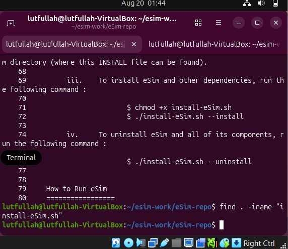
*`INSTALL` file's instructions (referencing `install-eSim.sh`), followed by `find . -iname "install-eSim.sh"` returning no output — confirmed absent from the cloned source tree.*

**Root cause:**
`install-eSim.sh` most likely only ships inside the pre-packaged downloadable `.zip`/release build of eSim, not in the GitHub source repository that `INSTALL` is written for. This is a **documentation-vs-repository mismatch**: a new contributor cloning the repo (as `INSTALL` itself suggests) hits a dead end immediately.

**Why not fixed directly:** Resolving this requires a maintainer decision — either (a) update `INSTALL` to point users to `scripts/setup-esim.sh` instead, or (b) add the missing `install-eSim.sh` to the source tree. Making that call unilaterally risks diverging from the intended install flow, so this is reported with a recommendation rather than patched.

**Status:** ⚠️ Reported in this document for maintainer review.

---

### Issue B3 — `scripts/launcher-esim.sh`: Broken Snap-based path resolution (blocks GUI launch)

**Severity: High — this directly prevents the main eSim GUI from starting.**

**The original, unmodified script relied entirely on Snap-only variables:**

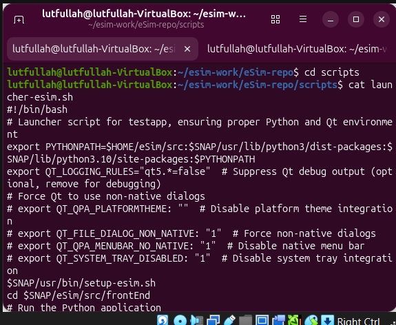
*`cat launcher-esim.sh` showing the original script — `$SNAP/usr/bin/setup-esim.sh` and `cd $SNAP/eSim/src/frontEnd`, both only valid inside a Snap installation.*

**Symptom when run as-is:**
```
launcher-esim.sh: line 10: /usr/bin/setup-esim.sh: No such file or directory
launcher-esim.sh: line 11: cd: /eSim/src/frontEnd: No such file or directory
python3: can't open file '.../Application.py': No such file or directory
```

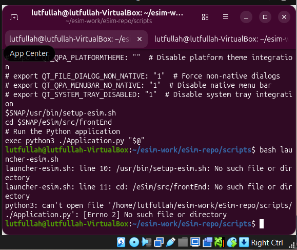
*Running the unmodified script — both `$SNAP`-based paths fail outright on a source install.*

**Root cause:**
Identical `$SNAP` pattern as Issue B1, but here it breaks the **actual GUI entry point**. `cd "$SNAP/eSim/src/frontEnd"` collapses to `cd /eSim/src/frontEnd` on a source install, which does not exist. The real entry point had to be located manually:

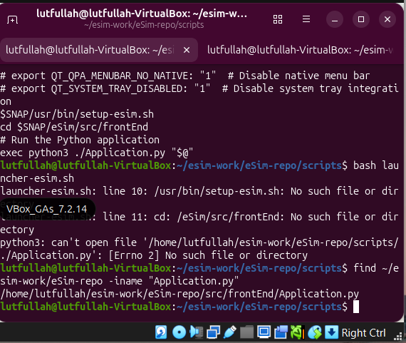
*`find ~/esim-work/eSim-repo -iname "Application.py"` locates the real entry point at `<repo-root>/src/frontEnd/Application.py`.*

**Fix:**
Rather than bypassing the launcher script, it was edited directly so the official launcher itself works for source installs:

- Commented out the Snap-only line `$SNAP/usr/bin/setup-esim.sh` (not applicable outside Snap).
- Changed `cd $SNAP/eSim/src/frontEnd` to:
  ```bash
  cd "$(dirname "$(pwd)")/src/frontEnd"
  ```

**Verification:** After the fix, `bash launcher-esim.sh` correctly reaches and executes `Application.py`. Confirmation of this is that the *exact* `$SNAP`-path errors above disappear completely, and execution proceeds to a new, unrelated error (missing Python module `PyQt6`) — proving the path-resolution problem was fully eliminated:

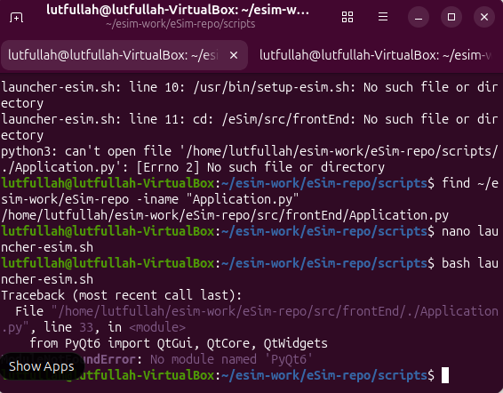
*After the fix, the `$SNAP` path errors are gone entirely — the script now runs `Application.py` and fails only on the next real issue, `ModuleNotFoundError: No module named 'PyQt6'`.*

**Status:** ✅ Fixed, committed, and pushed to `scripts/launcher-esim.sh`.

---

### Issue B4 — Missing Python Dependency Chain (blocks GUI launch)

**Severity: High — a dependency chain that interrupts installation of the main GUI of eSim.**

Once Issue B3 was resolved, `Application.py` began executing but failed repeatedly as it hit successive missing Python modules. Each was diagnosed and resolved in sequence.

**4.1 — `PyQt6` missing**
```
ModuleNotFoundError: No module named 'PyQt6'
```

Root cause: Qt6 Python bindings (the GUI toolkit eSim's frontend is built on) and `pip3` itself were not present on a clean system. Initial attempts to install `pip3`/`python-pip` via `apt` failed with "no installation candidate":

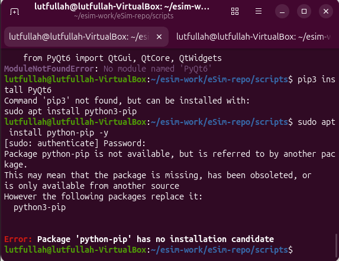
*`pip3` not found, and `sudo apt install python-pip` fails — the correct package name on modern Ubuntu is `python3-pip`.*

Fix — installed `python3-pip` correctly, then installed PyQt6 with the required flag for externally-managed environments:
```bash
sudo apt install python3-pip -y
pip3 install PyQt6 --break-system-packages
```

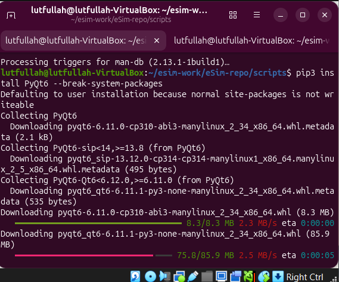
*PyQt6, PyQt6-Qt6, and PyQt6-sip downloading and installing.*

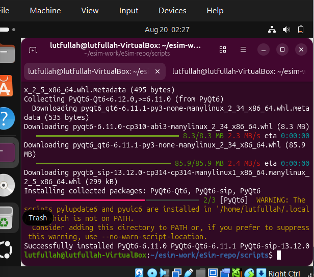
*Confirmation: `Successfully installed PyQt6-6.11.0 PyQt6-Qt6-6.11.1 PyQt6-sip-13.12.0`.*

**4.2 — `numpy` missing**
```
ModuleNotFoundError: No module named 'numpy'
```

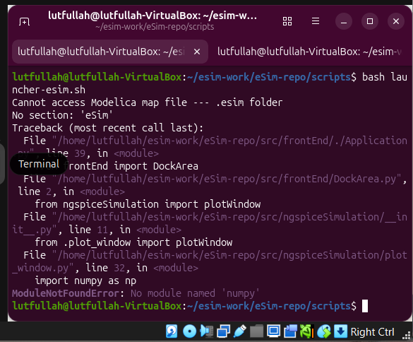
*Re-running `launcher-esim.sh` after the PyQt6 fix — the next module in the import chain, `numpy`, is missing.*

Fix:
```bash
pip3 install numpy --break-system-packages
```

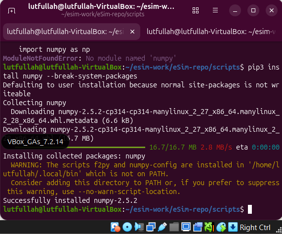
*`Successfully installed numpy-2.5.2`.*

**4.3 — `matplotlib` missing**
```
ModuleNotFoundError: No module named 'matplotlib'
```
(raised from `src/ngspiceSimulation/plot_window.py`, which imports `matplotlib.pyplot`)
Fix:
```bash
pip3 install matplotlib --break-system-packages
```

**4.4 — `hdlparse` missing *and* incompatible with modern Python (deepest root cause found)**
```
ModuleNotFoundError: No module named 'hdlparse'
```
(raised from `src/maker/Maker.py`, which imports `hdlparse.verilog_parser`)

A first attempt to install the obvious candidate failed:
```bash
pip3 install hdlparse --break-system-packages
# error in hdlparse setup command: use_2to3 is invalid
```

**Root cause investigation:** The `hdlparse` package published on PyPI (v1.0.1) has not been updated since ~2016. Its `setup.py` sets `use_2to3=True`, a setuptools feature that used to auto-convert Python 2 source to Python 3 at install time. Modern `setuptools` (v58+) has **removed `2to3` support entirely**, so this package cannot install on *any* current Ubuntu/Python system — not specific to this VM.

An attempted workaround (downgrading `setuptools` to `<58`) failed for a second, independent reason: Python 3.14 has removed `pkgutil.ImpImporter`, an API old `setuptools` versions depend on:
```
AttributeError: module 'pkgutil' has no attribute 'ImpImporter'
```
This confirmed the downgrade path was a dead end. `setuptools` was restored to latest.

**Actual fix:** A maintained fork of `hdlparse` exists that removes the Python 2 / `2to3` dependency entirely: [`github.com/hdl/pyHDLParser`](https://github.com/hdl/pyHDLParser).
```bash
pip3 install --upgrade "https://github.com/hdl/pyhdlparser/tarball/master" --break-system-packages
```
Result: `Successfully installed hdlparse-1.0.7` (fork version; the abandoned PyPI package was `1.0.1`).

**Recommendation for maintainers:** eSim's requirements/setup documentation should either pin the working fork (`hdl/pyHDLParser`) directly, or vendor a small compatible verilog/VHDL parser, since the PyPI `hdlparse` dependency is permanently broken on any current Python toolchain. *(This is the same root cause independently confirmed in Part A, Issue 2 — the abandoned PyPI `hdlparse` package breaks both the `installers`-branch script and the from-source install path.)*

**Status:** ✅ All four sub-dependencies fixed. This was the deepest and most technically involved fix in this task.

---

### Issue B5 — `.esim` config directory not created, workspace selection crashes

**Severity: High — this also directly blocks the GUI on first launch.**

**Symptom:**
```
FileNotFoundError: [Errno 2] No such file or directory: '/home/lutfullah/.esim/workspace.txt'
```

**Root cause:**
`src/frontEnd/Workspace.py` (`createWorkspace`, line 133) attempts to write directly to `~/.esim/workspace.txt` without first checking whether the parent directory `~/.esim` exists. On a first-time install, this directory has never been created, so the `open(..., 'w')` call fails outright.

**Fix:**
```bash
mkdir -p ~/.esim
```
This should ideally be handled inside `Workspace.py` itself (e.g. `os.makedirs(os.path.dirname(path), exist_ok=True)` before opening the file) rather than requiring the user to pre-create it — noted here as a recommended code-level fix for maintainers.

**Verification:** After creating the directory, `bash launcher-esim.sh` → workspace dialog → "OK" completed without error, and the full eSim-2.5 GUI loaded successfully.

**Status:** ✅ Fixed (workaround applied; root cause and a suggested proper code fix documented above for maintainers).

---

### Part B — Final Result

After resolving Issues B1, B3, B4, and B5, running `bash launcher-esim.sh` from a completely clean Ubuntu 26.04 VM completes the entire chain — Snap-path resolution, all four Python dependencies, and workspace initialization — and launches the full eSim-2.5 main window with no errors:

```
eSim Started......
Project Selected : None
[INFO]: Workspace : /home/lutfullah/eSim-Workspace
```

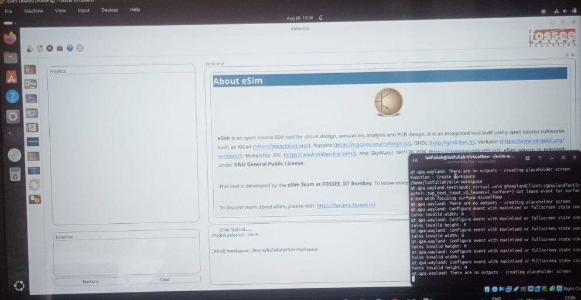
*The full eSim-2.5 main window running successfully, with the terminal alongside confirming a clean workspace initialization and no errors.*

### Part B — Evaluation Summary

- **Issues Reported:** 5 (8 distinct root causes)
- **Issues Fixed:** 4 of 5 (Issue B2 reported to maintainers by design, not patched)
- **Documentation:** Each issue includes symptom, root cause, fix/status, and verification
- **Difficulty:** Issue B4 (Python dependency chain) required diagnosing two independent, non-obvious failure modes (`use_2to3` removal and `pkgutil.ImpImporter` removal) before finding a working fork-based fix

---

# Combined Evaluation Summary

| | Part A (`installers`) | Part B (`master`) | Combined |
|---|---|---|---|
| Issues Reported | 6 | 5 | **9** (across both branches) |
| Issues Fixed | 2 | 4 | **6** |
| GUI Launch Verified | N/A (script-only) | ✅ Yes | ✅ Yes |

Testing across both the dedicated installer script (`installers` branch) and a full from-source build (`master` branch) gave broader coverage of the ways a new contributor might set up eSim on a modern Ubuntu system, and surfaced one independently-confirmed shared root cause (the abandoned PyPI `hdlparse` package) affecting both paths — reinforcing that this is a real upstream issue rather than an environment-specific quirk.
