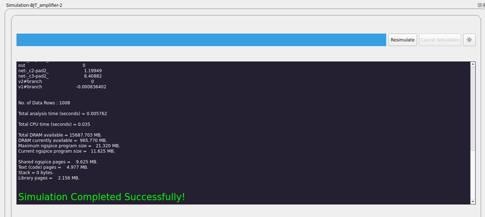

TerminalUI Component
====================

The TerminalUI component provides a graphical interface for monitoring and controlling ngspice simulations within eSim. It features a progress bar, a simulation log console, and buttons for toggling light/dark mode, cancelling, and re-running simulations.

**Features:**
- Displays real-time simulation logs and progress.
- Allows users to cancel or redo simulations.
- Supports toggling between light and dark modes for better visibility.
- Integrates with ngspice using PyQt5's QProcess for process management.

**Usage:**
The TerminalUI is automatically launched during simulation runs. Users can interact with the simulation process using the provided buttons and view logs in the console area.

.. note::

   Source : ``src/frontEnd/TerminalUi.py``

.. automodule:: frontEnd.TerminalUi
    :members: