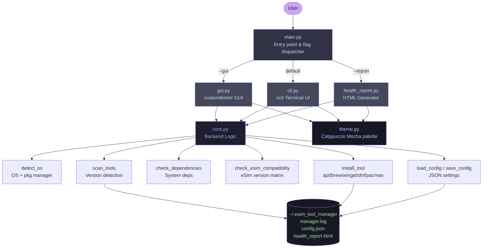
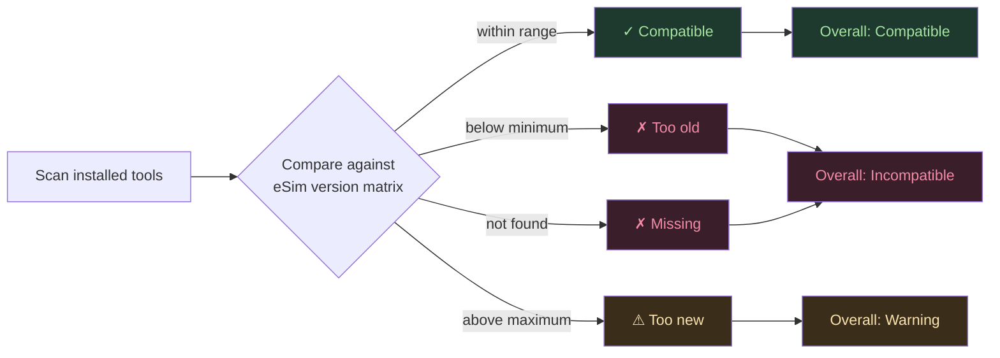

# eSim Tool Manager

<div align="center">

**One tool that handles your entire tool ecosystem**


[Commands](#commands) · [Architecture](#architecture) · [Features](#features) · [Health Report](#health-report) · [Design Document](DESIGN_DOCUMENT.md)

</div>

---

## The Main Problem

Setting up eSim from scratch is a fragmented experience. You need the right version of Ngspice for your eSim release, a compatible KiCad build, GHDL and Verilator for NgVeri mixed-signal work, and OpenModelica for system-level modelling each with its own installation quirks, PATH requirements, and version constraints. A single wrong version silently breaks simulation runs.

`esim-tm` is a purpose-built manager that handles the entire lifecycle: discovery, installation, version validation against specific eSim releases, dependency checking, and health reporting with both a terminal interface and a full graphical dashboard.

---

## Display inducing Commands

```
python3 main.py --scan         →  shows every tool, version, and status
python3 main.py --check        →  checks all system dependencies
python3 main.py --compat 2.5   →  validates tools against eSim 2.5 requirements
python3 main.py --report       →  generates a full HTML health report
python3 main.py --gui          →  opens the Catppuccin-themed dashboard
```

---

## Features

| Feature | Details |
|---|---|
| **Tool Scanner** | Detects KiCad, Ngspice, GHDL, Verilator, OpenModelica — versions + paths |
| **eSim Compatibility Matrix** | Validates installed versions against eSim 2.3 / 2.4 / 2.5 requirements |
| **Dependency Checker** | Checks gcc, cmake, git, libffi-dev and other system deps |
| **Tool Installer** | Installs via apt / brew / winget / dnf / pacman — auto-detected |
| **GUI Dashboard** | Full customtkinter desktop app — 6 panels, live progress dialogs |
| **Rich Terminal UI** | Catppuccin-themed tables, spinners, colour-coded status |
| **HTML Health Report** | Self-contained shareable report — opens in browser automatically |
| **Persistent Logging** | Every action timestamped to `~/.esim_tool_manager/manager.log` |
| **JSON Config** | User settings persisted to `~/.esim_tool_manager/config.json` |
| **Cross-platform** | Auto-detects OS and package manager — no manual config needed |
| **Dry-run mode** | Preview install commands without executing — safe for testing |
| **One-liner installer** | `curl | bash` install script for end users |

### Requirements Coverage

| # | Requirement | Status |
|---|---|---|
| 1 | Tool Installation Management | Implemented |
| 2 | Update & Upgrade System | Partial |
| 3 | Configuration Handling | Implemented |
| 4 | Dependency Checker | Implemented |
| 5 | User Interface + Logging | Implemented (both GUI and CLI) |
| 6 | Cross-platform + Package Manager Integration | Implemented |

---

## Quick start Guide
## For Linux Users

### Prerequisites
- Python 3.10+

### Install dependencies

```bash
pip install customtkinter rich --break-system-packages
```

### One-liner install

```bash
curl -sSL https://raw.githubusercontent.com/Princess0407/esim-tool-manager/main/install.sh | bash
```

### Run from source

```bash
git clone https://github.com/Princess0407/esim-tool-manager.git
cd esim-tool-manager
pip install customtkinter rich --break-system-packages
python3 main.py
```
## For Windows Users

## 1. Prerequisites
* **Python 3.10+**: Download from [python.org](https://www.python.org/downloads/windows/). 
    * **CRITICAL:** Check the box **"Add Python to PATH"** during installation.
* **Git**: Install [Git for Windows](https://gitforwindows.org/).

## 2. Installation Steps
Open **PowerShell** (search for it in the Start menu and select **Run as Administrator**(helpful in preventing permission issues).

#### Clone the repository
```powershell
git clone [https://github.com/Princess0407/esim-tool-manager.git](https://github.com/Princess0407/esim-tool-manager.git)
cd esim-tool-manager
```

### Create a virtual environment
```powershell
python -m venv venv
```

### Activate the environment
```powershell
.\venv\Scripts\activate
```

### Install dependencies
```powershell
pip install customtkinter rich
```

### Run the application
```powershell
python main.py
```
## For Mac users

## 1. Prerequisites

Before starting, ensure you have the following installed:

* **Homebrew**: The easiest way to manage packages on macOS. If you don't have it, install it from [brew.sh](https://brew.sh/).
* **Python 3.10+**: Install the latest version via Homebrew to ensure all dependencies work correctly:
    ```zsh
    brew install python
    ```
* **Git**: Usually pre-installed on macOS, but can be updated via:
    ```zsh
    brew install git
    ```

---

## 2. Installation Steps

Open your **Terminal** and run the following commands:

### Clone the Repository**
```zsh
git clone [https://github.com/Princess0407/esim-tool-manager.git](https://github.com/Princess0407/esim-tool-manager.git)
cd esim-tool-manager
```
### Create a Virtual Environment
```zsh
python3 -m venv venv
```

### Activate the Environment
```zsh
source venv/bin/activate
```
*Note: (Once activated, you should see (venv) appear at the beginning of your terminal prompt.)*

### Install Dependencies
```zsh
pip install customtkinter rich
```
### Run the Application
```zsh
python3 main.py
```
---

## Commands

| Command | What it does |
|---|---|
| `python3 main.py` | Interactive terminal menu (default) |
| `python3 main.py --gui` | Launch graphical dashboard |
| `python3 main.py --scan` | Scan installed tools, print version table |
| `python3 main.py --check` | Check all system dependencies |
| `python3 main.py --compat 2.5` | Validate tools against eSim 2.5 |
| `python3 main.py --compat 2.4` | Validate tools against eSim 2.4 |
| `python3 main.py --compat 2.3` | Validate tools against eSim 2.3 |
| `python3 main.py --report` | Generate HTML health report, open in browser |
| `python3 main.py --install Ngspice` | Install Ngspice via system package manager |
| `python3 main.py --install KiCad --dry-run` | Preview install command without executing |

### Interactive menu options

```
  [1]  Check dependencies
  [2]  Scan installed tools
  [3]  Install a tool
  [4]  eSim compatibility check
  [5]  Generate health report
  [6]  View configuration
  [7]  View action log
  [q]  Quit
```

---

## Architecture



### eSim Compatibility Flow



### Project Structure

```
esim-tool-manager/
├── main.py              # Entry point — CLI flags, dispatches to gui or cli
├── gui.py               # customtkinter GUI — 6 panels, progress dialogs
├── cli.py               # rich terminal interface — menus and tables
├── core.py              # Backend — scanner, installer, dep checker, logger, config
├── health_report.py     # HTML health report generator
├── theme.py             # Catppuccin Mocha palette constants
├── install.sh           # One-liner installer for end users
├── requirements.txt     # pip dependencies
├── DESIGN_DOCUMENT.md   # Full architecture document
├── SAMPLE_OUTPUTS.txt   # Real terminal output examples
└── docs/
    ├── ARCHITECTURE.md  # Module interaction deep-dive
    ├── FEATURES.md      # Full feature reference
    └── USAGE.md         # Real-world usage workflows
```

---

## eSim Tool Roles

This manager is built specifically for eSim — not a generic package manager. It understands exactly why each tool exists:

| Tool | eSim Component | Role |
|---|---|---|
| **KiCad** | Schematic + PCB | Primary front-end Eeschema for circuit drawing, Pcbnew for PCB layout |
| **Ngspice** | Circuit Simulation | Core engine eSim converts schematics to SPICE netlists for Ngspice |
| **GHDL** | HDL Simulation (NgVeri) | Compiles VHDL for mixed-signal co-simulation via XSPICE |
| **Verilator** | HDL Simulation (NgVeri) | Compiles Verilog/SystemVerilog for NgVeri mixed-signal simulation |
| **OpenModelica** | System Modeling | Multi-domain modeling for control systems and thermal analysis |

### eSim Version Compatibility Matrix

| Tool | eSim 2.3 | eSim 2.4 | eSim 2.5 | Critical |
|---|---|---|---|---|
| Ngspice | 36 – 38 | 38 – 40 | 40 – 42 | Yes |
| KiCad | 5.1 – 6.0 | 6.0 – 7.0 | 8.0 – 9.0 | Yes |
| GHDL | 1.0 – 2.0 | 2.0 – 3.0 | 3.0 – 4.1 | No |
| Verilator | 4.2 | 4.2 – 5.0 | 5.0 – 5.024 | Yes (2.4+) |
| OpenModelica | 1.18 – 1.20 | 1.20 – 1.22 | 1.22 – 1.24 | No |

---

## Health Report

Running `python3 main.py --report` generates a self-contained Catppuccin-themed HTML file saved to `~/.esim_tool_manager/health_report.html` and opens it automatically in your browser. It contains:

- System overview (OS, Python, architecture, package manager)
- eSim component roles what each tool does inside eSim
- Full compatibility matrix for eSim 2.3, 2.4, and 2.5
- Tool scan results with version and path
- Dependency check with fix commands for missing deps
- Last 40 lines of the action log

The report is fully self-contained — share it as a single HTML file.

---

## Supported Platforms

| Platform | Package Manager | Status |
|---|---|---|
| Debian / Ubuntu | `apt` | Fully supported — primary target |
| Fedora / RHEL | `dnf` | Supported |
| Arch Linux | `pacman` | Supported |
| macOS | `brew` (Homebrew) | Supported |
| Windows 10/11 | `winget` or `choco` | Supported |

---

## Configuration

Stored at `~/.esim_tool_manager/config.json`, created automatically on first run:

```json
{
  "theme": "mocha",
  "auto_update": false,
  "log_level": "info",
  "esim_path": "/home/user/eSim",
  "check_on_start": true
}
```

---

## Logging

Every action logged to `~/.esim_tool_manager/manager.log`:

```
2026-04-13 10:12:01  [INFO]    OS detected: Debian GNU/Linux 12 · package manager: apt
2026-04-13 10:12:02  [INFO]    Tool scan: Ngspice → ok (40.1)
2026-04-13 10:12:02  [WARNING] Tool scan: KiCad → update (8.0.3)
2026-04-13 10:12:03  [ERROR]   Dep check: libffi-dev → missing
2026-04-13 10:12:04  [INFO]    eSim 2.5 compat: Ngspice → ok (v40.1 within 40–42)
```

---

## Documentation

| Document | Contents |
|---|---|
| [DESIGN_DOCUMENT.md](DESIGN_DOCUMENT.md) | Full architecture, module breakdown, design decisions |
| [docs/ARCHITECTURE.md](docs/Architecture.md) | Component diagrams, execution flow |
| [docs/FEATURES.md](docs/Features.md) | Full feature reference with implementation details |
| [docs/USAGE.md](docs/Usage.md) | Real executed workflows with outputs |
| [SAMPLE_OUTPUTS.txt](SAMPLE_OUTPUTS.txt) | Real terminal output from all commands |

---

## License

MIT License — developed as part of eSim Summer Fellowship 2026, Task 5.

<div align="center">
<sub>Built for FOSSEE eSim Summer Fellowship 2026 · IIT Bombay</sub>
</div>

